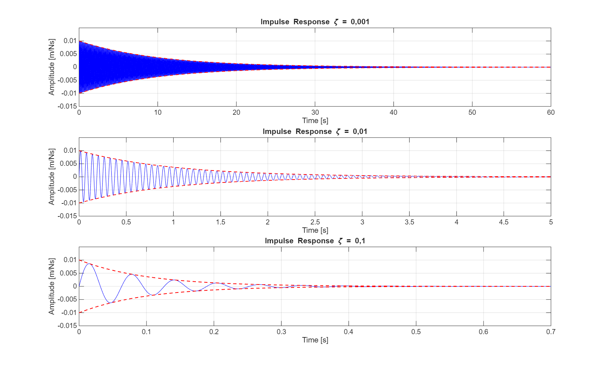
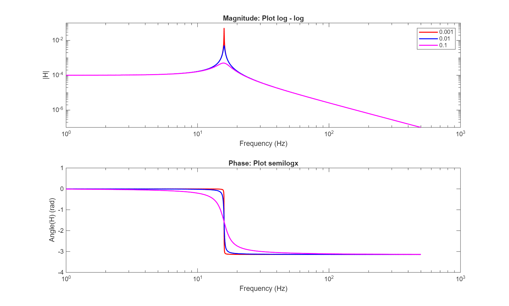

# SDOF Impulse Response Analysis

Analytical and numerical vibration analysis of damped single degree-of-freedom (SDOF) mechanical systems using MATLAB.

---

## Overview

This repository contains vibration analysis studies for damped single degree-of-freedom (SDOF) mechanical systems using MATLAB.

The project investigates the dynamic behavior of mechanical systems under impulse excitation using analytical and numerical approaches.

---

## Key Features

- Impulse response simulation
- Frequency Response Function (FRF) analysis
- Structural dynamics modeling
- Frequency-domain signal analysis
- Damping ratio comparison
- Mechanical vibration analysis

---

## Methodology

The system response was obtained analytically and compared against numerical frequency-domain estimations using classical structural dynamics and signal processing techniques.

The analyses were performed for multiple damping ratios in order to evaluate the influence of damping on the system dynamic response.

---

## Implemented Analyses

- Time-domain impulse response simulation
- FRF magnitude and phase analysis
- Velocity and acceleration frequency responses
- Analytical vs numerical solution comparison

---

## Example Results

### Impulse Response

---

### Frequency Response Function

---

## Technologies

- MATLAB
- Structural Dynamics
- Signal Processing
- Frequency Response Analysis

---

## Applications

- Structural dynamics
- Vibroacoustic systems
- Mechanical vibration analysis
- Engineering signal processing
- Frequency-domain system analysis

---

## Author

André Luis Vinagre Pereira

PhD Candidate in Mechanical Engineering

---

This project is part of a broader research and computational engineering series focused on structural dynamics, signal processing, and vibroacoustic systems.
